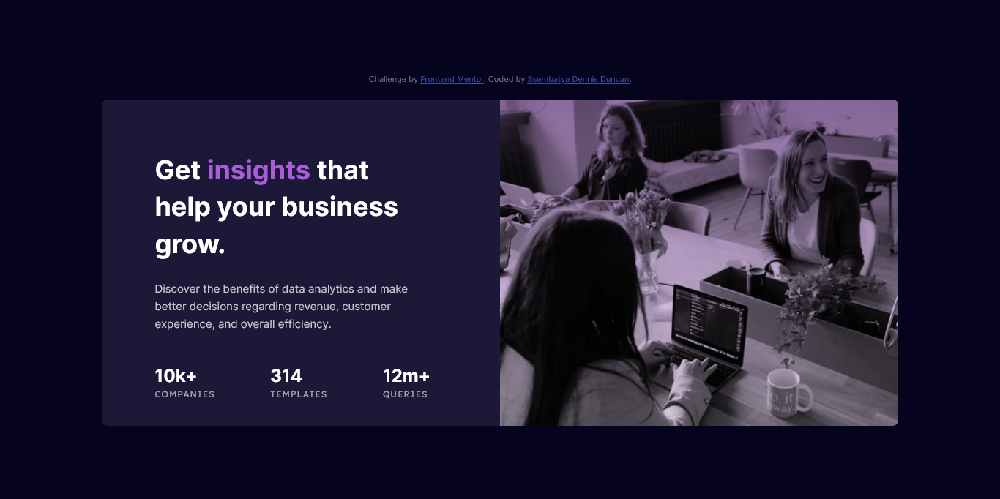

# Frontend Mentor - Stats preview card component solution

This is a solution to the [Stats preview card component challenge on Frontend Mentor](https://www.frontendmentor.io/challenges/stats-preview-card-component-8JqbgoU62). Frontend Mentor challenges help you improve your coding skills by building realistic projects.

### The challenge

Users should be able to:

- View the optimal layout depending on their device's screen size

### Screenshot

- Desktop view
  

### Links

- Solution URL: [Stats preview card component challenge on Frontend Mentor](https://www.frontendmentor.io/solutions/responsive-stats-preview-card-component-gH19FVt6Dr)
- Live Site URL: [Stats preview card component challenge #live site](https://stats-preview-card-component-cyan-chi.vercel.app/)

### Built with

- Semantic HTML5 markup
- CSS
- Flexbox

### What I learned

In this challenge I learnt about background blend modes in CSS.

## Author

- Frontend Mentor - [@ssembatya-dennis](https://www.frontendmentor.io/profile/ssembatya-dennis)
- Twitter - [@DennisSsembatya](https://twitter.com/DennisSsembatya)
